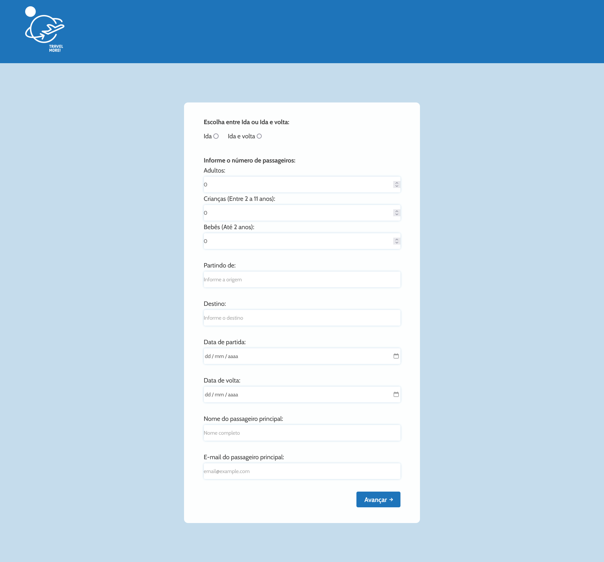

# Página de checkout para uma agência de turismo

### Live link
> https://pagina-checkout-git-alternative-willianmassayuki.vercel.app/

## Visão geral
Uma página responsiva de checkout para uma agência de turismo contendo um formulário multistep com validações básicas para garantir a integridade e validade dos dados. 

### Captura de tela

## Como instalar e acessar localmente

- É preciso ter o Node.JS instalado. Ou acesse o link para download:
> https://nodejs.org/en/download

- Recomendo também o uso do Git:
> https://git-scm.com/downloads

- Crie uma pasta com um nome qualquer onde preferir. Ex: 'Projetos' na área de trabalho.

- Dentro da pasta clique com o botão direito do mouse e escolha a opção:
> 'Git Bash Here'

- Com o terminal aberto faça um clone do projeto digitando:
> git clone https://github.com/willianmassayuki/pagina-checkout.git

- Ou faça o downloado o arquivo zip e o descompacte na pasta 'Projetos'

- Dentro da pasta do projeto onde se encontram as pastas 'src', 'public', 'node_modules' 
abra o terminal do git novamente com o botão direito do mouse vá em 'Git Bash Here' e digite o comando:
> npm install vite 

- Para rodar o projeto digite o comando:
> npm run dev

- Aperte Ctrl e clique no endereço local

## Para testar
- Passe o mouse sobre os elementos da tela para verificar os efeitos de interação;
- Redimensione o tamanho da janela do navegador para conferir a responsividade;
- Preencha os dados e avance as etapas para ver o funcionamento completo; 

### Construído com
React.JS
SASS
HTML
Vite
